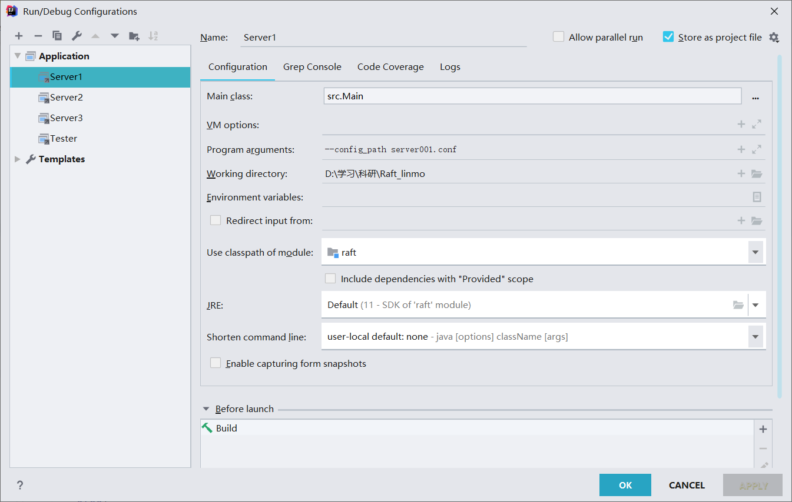
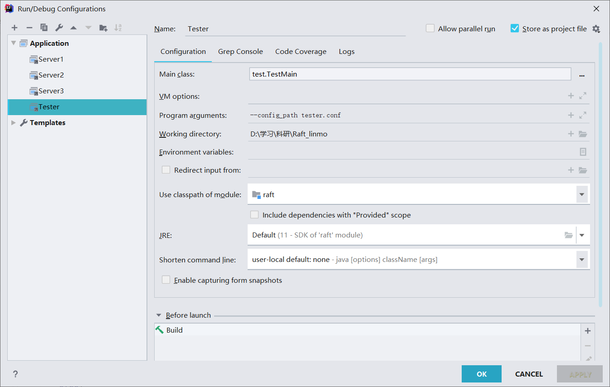
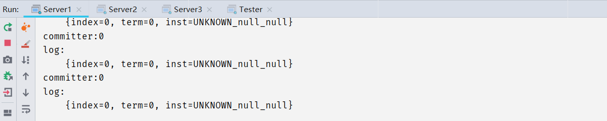
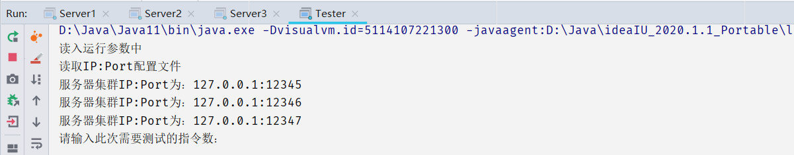
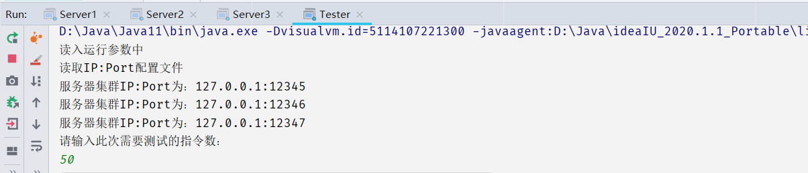
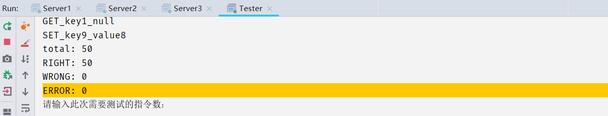

# Raft_linmo
##### 简介

> 这是我根据Raft算法写的小型分布式系统。
>
> 主要分为2个部分：服务器集群和Tester测试器。
>
> > 前者为分布式系统运行集群，由3个及以上的服务器构成（数量可自行配置），后者为测试器（主要是自动生成指令，并检测服务器集群是否能正确且快速地响应指令）
> >
> > Tester可自行修改，以适应不同需求。（指令API参考后续）
>
> **Raft介绍**：[Raft Consensus Algorithm](https://raft.github.io/)

##### 信息

> **名称**：Raft_linmo
>
> **作者**：linmo
>
> **时间**：2022/5/25
>
> **邮箱**：linmo@hnu.edu.cn

##### 环境

> - 编译器：IntelliJ IDEA 2020.1
>
> - 系统：Windows 64位
>
> - Java版本：Java11

##### 源码配置和运行

> **配置和运行**：
>
> > - 创建工程，把`src`文件夹下的文件作为源文件加入到工程中（或者可以直接把整个工程文件夹都用IntelliJ打开，因为我已经配置好所有文件了）
> >
> > - 配置文件参考文件夹中的`.conf`文件进行编写（理论可以支持大量服务器，可以自己拓展）
> >
> > - 工程配置：
> >
> > 	> 以下是样例配置（服务器数量可以自己定，只要写好对应的`.conf`文件以及配好对应的工程）
> > 	>
> > 	> - Server
> > 	>
> > 	> 	> 
> > 	> 	>
> > 	> 	> - Main class：要运行的主入口，设置为src.Main（`src`文件夹下的`Main.java`）
> > 	> 	>
> > 	> 	> - Program arguments：运行参数，`--config_path`为固定语句，表示后续紧接着的是配置文件
> > 	>
> > 	> - Tester
> > 	>
> > 	> 	> 
> >
> > - 运行
> >
> > 	> 按照先运行服务器集群（顺序无要求，但至少运行一半及以上，整个集群才能正常运行），再运行测试器Tester的顺序
>
> **使用方法**
>
> > 正确配置运行后应形如下面：
> >
> > > - Server
> > >
> > > 	> 
> > >
> > > - Tester
> > >
> > > 	> 
> >
> > **使用**
> >
> > > - Server
> > >
> > > 	> 服务器集群部分无需输入等操作，其会自动运行并自组织
> > >
> > > - Tester
> > >
> > > 	> 输入要测试的指令数（大于0的整数），随后回车，测试器即可自动测试，并发送指令给服务器集群
> > > 	>
> > > 	> - 输入`50`
> > > 	>
> > > 	> 	> 
> > > 	>
> > > 	> - 运行后
> > > 	>
> > > 	> 	> 
> > > 	> 	>
> > > 	> 	> 此次测试通过率100%
> > > 	>
> > > 	> - 还可继续输入数字进行测试

##### 指令

> - SET指令：set(key,value)，key为键，value为值
>
> 	> 在KV系统中，设置一对键值对应，即键为key的值为value
> 	>
> 	> 一次仅设置一对
>
> - DEL指令：del(key1,...)，key为键
>
> 	> 在KV系统中，删除键为key的数据对（键值一起删除）
> 	>
> 	> 可以一次删除多个数据对，即del(key1,key2,key3,....)
>
> - GET指令：get(key)，key为键
>
> 	> 在KV系统中，获取键为key对应的值（返回该值）
> 	>
> 	> 一次仅获取一对

##### 报文格式

> 分两类，一类是服务器集群的内部通信，一类是服务器集群和Tester之间的外部通信
>
> **内部通信**
>
> > ```c
> > Message{    // 内部交互报文的格式
> >     term:IP:Port:type:value1|value2|....
> >     // 例如：2:127.0.0.1:12345:RV:0|0|
> >     // AppendEntries：term:IP:Port:AE:last_index|last_term|index|term|inst
> >     // AE(Heartbeat)：term:IP:Port:AE:last_index|last_term|
> >     // RequestVote：2:127.0.0.1:12345:RV:last_index|last_term|
> >     // Reject：term:IP:Port:RJ:index|
> >     // OK：term:IP:Port:OK:index
> > }
> > ```
>
> **外部通信**
>
> > 报文格式为RESP报文格式（详细请参考RESP报文）
> >
> > ```c
> > RESP{       // Server应答报文格式
> >     OK:{ +OK\r\n }
> >     ERROR:{ -ERROR\r\n }
> >     NIL:{ *1\r\n$3\r\nnil\r\n }
> >     应答GET:{ *2\r\n$5\r\nHappy\r\n$8\r\nEveryday\r\n }
> >     应答DEL:{ :1\r\n }
> >     SET:{   // SET指令及对应行为
> >         // SET Teacher "Happy Everyday"
> >         *4\r\n$3\r\nSET\r\n$7\r\nTeacher\r\n$5\r\nHappy\r\n$8\r\nEveryday\r\n
> >         成功回复OK;
> >         若错误发生回复ERROR;
> >     }
> >     GET:{   // GET指令及对应行为
> >         // GET Teacher
> >         *2\r\n$3\r\nGET\r\n$7\r\nTeacher\r\n
> >         成功回复 应答GET (注意, 仅返回Value);
> >         若不存在, 则返回NIL;
> >         若错误发生回复ERROR;
> >     }
> >     DEL:{   // DEL指令及对应行为
> >         // DEL Teacher CS162
> >         *3\r\n$3\r\nDEL\r\n$7\r\nTeacher\r\n$5\r\nCS162\r\n
> >         成功回复 应答DEL (注意, 要根据成功执行的数量);
> >         若错误发生回复ERROR;
> >     }
> > }
> > ```

##### IP端口配置文件格式（`.conf`文件）

> 参考文件夹中的`.conf`，所有IP端口配置文件均命名为`.conf`文件格式
>
> 数据格式为三元组`name IP:Port`
>
> > - name：为`self_info`或`other_info`，前者表示自身IP端口，后者表示其他服务器的IP端口（在Tester中，表示整个服务集群的IP端口）
> > - IP：形如`127.0.0.1`，可以为网上服务器地址（只要自己配置好）
> > - Port：端口
>
> 以`!`开头的为注释

##### 程序简单框架

> 仅供参考，和代码的实际实现有所出入
>
> ```c
> election time;  // 选举超时标准范围
> log{	// 日志
>     log entries;		// 日志条目组
>         (log entry = log index + 任期号(term) + 状态机指令)
> };
> AppendEntries{      // AppendEntries报文结构
>     last = index + term;    // 上一条条目：用于保持一致性的校验结构
>     now  = index/0 + term/0 + 状态集指令/NULL  // 当前条目
> };
> OK{
>     index;  // 当前确认的index
> }
> Reject{             // Reject拒绝报文结构
>     冲突的term的第一条index;
> };
> RequestVote{        // 请求投票报文结构
>     最新的index + 最新的term;
> }
> Message{    // 内部交互报文的格式
>     term:IP:Port:type:value1|value2|....
>     // 例如：2:127.0.0.1:12345:RV:0|0|
>     // AppendEntries：term:IP:Port:AE:last_index|last_term|index|term|inst
>     // AE(Heartbeat)：term:IP:Port:AE:last_index|last_term|
>     // RequestVote：2:127.0.0.1:12345:RV:last_index|last_term|
>     // Reject：term:IP:Port:RJ:index|
>     // OK：term:IP:Port:OK:index
> }
> RESP{       // Server应答报文格式
>     OK:{ +OK\r\n }
>     ERROR:{ -ERROR\r\n }
>     NIL:{ *1\r\n$3\r\nnil\r\n }
>     应答GET:{ *2\r\n$5\r\nHappy\r\n$8\r\nEveryday\r\n }
>     应答DEL:{ :1\r\n }
>     SET:{   // SET指令及对应行为
>         // SET Teacher "Happy Everyday"
>         *4\r\n$3\r\nSET\r\n$7\r\nTeacher\r\n$5\r\nHappy\r\n$8\r\nEveryday\r\n
>         成功回复OK;
>         若错误发生回复ERROR;
>     }
>     GET:{   // GET指令及对应行为
>         // GET Teacher
>         *2\r\n$3\r\nGET\r\n$7\r\nTeacher\r\n
>         成功回复 应答GET (注意, 仅返回Value);
>         若不存在, 则返回NIL;
>         若错误发生回复ERROR;
>     }
>     DEL:{   // DEL指令及对应行为
>         // DEL Teacher CS162
>         *3\r\n$3\r\nDEL\r\n$7\r\nTeacher\r\n$5\r\nCS162\r\n
>         成功回复 应答DEL (注意, 要根据成功执行的数量);
>         若错误发生回复ERROR;
>     }
> }
> Server{ // 服务器原型
>     type:leader,follower,candidate; // 服务器类型
>     term;   // 任期号
>     leader:IP+Port; // leader的IP和端口号
>     all servers:IP+Port;    // 所有服务器的类型
>     log;    // 日志
> functions:
>     init:{  // 初始化
>         type = follower;    // type设置为follower
>         term = 1;           // 任期从1开始
>         get IP:Port;        // 读取IP:Port信息
>         log init;           // 初始化日志
>     }
> events:
>     if receive message:{    // 如果收到了其他服务器的信息
>         if term > my:{  // 若任期大于自己的
>             type = follower;// 将类型置为follower
>             my = term;      // 更新term为较大的那个
>             if AppendRequest:{  // 如果收到的是AppendRequest报文
>                 更新 leader IP+Port;
>                 do what follower do
>             }
>             if RequestVote:{
>                 do what follower do
>             }
>         }
>         if term = my:{  // 若任期一致
>             // 则看各类型具体实现
>         }
>         if term < my:{  // 若任期小于自己
>             ignore;     // 则忽略
>         }
>     }
> 
> };
> Leader:Server{
>     committed entries;  // 已提交指针(index类型)
>     all servers:nextIndex;  // 要发送的下一个条目位置
> functions:
>     init:{      // 初始化
>         committed entries = now index;
>         nextIndex = committed entries + 1;
>     }
>     create send:{   // 创建一个发送
>         OK_cnt = 1; // 初始化收到的OK数量为1
>         for in servers:{    // 遍历servers
>             send AppendEntries; // 给每个服务器发送AppendEntries报文
>         }
>     }
>     send AppendEntries:{    // 发送信息AppendEntries
>         通信过程:leader ----AppendEntries----> follower ----OK/Reject----> leader
>     }
> events:
>     if receive Reject:{     // 若收到拒绝
>         nextIndex = index;  // 更新nextIndex的值
>     }
>     if receive OK:{         // 若收到成功回复
>         nextIndex ++;       // 更新对应的nextIndex
>         OK_cnt ++;          // 更新收到的OK数量
>         if OK_cnt > (n/2+1):{   // 若收到的大多数OK
>             committed entries = max(committed entries, index);  // 更新已提交的条目位置
>         }
>     }
>     if receive Client:{     // 若收到Client的信息
>         deal with 状态机指令;   // 则进行处理
>     }
> };
> Follower:Server{
>     vote term;      // 记录已经投票的任期
> functions:
>     init:{
>         vote term = 0;  // 初始化，表示还未投票
>     }
>     wait for AppendEntries:{    // 日常情况
>         set election time;      // 设置选举时间，进入等待
>         if flash time:{ // 若收到消息
>             goto wait for AppendEntries;    // 则重新开始等待
>         }
>         if timeout:{    // 若超时
>             type = candidate;   // 变为候选者
>         }
>     }
> events:
>     if receive AppendEntries:{  // 如果收到AppendEntries
>         flash time;     // 刷新时钟
>         if find last:{          // 如果找到last
>             accept now;         // 根据报文，应用操作，更新日志
>             send OK;            // 返回OK
>         }
>         else:{                  // 如果找不到
>             send Reject;        // 返回拒绝
>         }
>     }
>     if receive RequestVote:{    // 如果收到投票请求
>         flash time;     // 刷新时钟
>         if vote term > term:{   // 若已经投过
>             ignore;
>         }
>         else{
>             if new:{            // 若新，则投票
>                 vote;
>                 voted;
>             }
>         }
>     }
>     if receive Client:{     // 若收到Client的信息
>         reload to leader;   // 重定向指leader
>     }
> };
> Candidate:Server{
>     vote cnt;       // 记录已经获得的选票数
> functions:
>     init:{
>         term++;     // 任期加1
>         vote cnt = 1;   // 给自己投票
>     }
>     create send:{   // 创建一个发送
>         set election time;      // 设置选举时间，进入等待
>         for in servers:{    // 遍历servers
>             send RequestVote;   // 给每个服务器发送RequestVote报文
>         }
>         wait for vote;      // 等待选票
>         if flash time:{
>             finish;     // 若刷新时间，则结束
>         }
>         if timeout:{    // 若超时
>             type = candidate;   // 变为候选者
>         }
>     }
>     send RequestVote:{  // 发送信息RequestVote
>         通信过程:candidate ----RequestVote----> follower ----vote/ignore----> candidate
>     }
> events:
>     if receive vote:{   // 收到选票
>         vote cnt++;     // 更新选票数
>         if vote cnt > (n/2+1):{ // 获得半数以上选票
>             flash time;
>             type = leader;  // 变为leader
>         }
>     }
>     if receive AppendEntries:{  // 收到AppendEntires
>         flash time;
>         type = follower;    // 变为follower
>     }
> }
> ```
